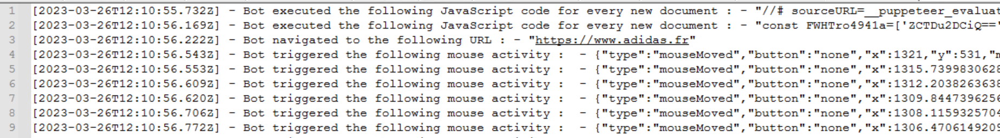

# BOT-MONITOR

This project is a tool to monitor CDP traffic between a bot and a fully fledge browser in order to filter meaningful activities and to understand the bot behavior.
This tool creates a new local proxy with a separate port per each new Chrome instance created by the bot.
One of the advantage of this project is that it's dynamically creating a proxy that listens to the port chosen by the browser. 

## Prerequisite
- Supported on Windows 10
- Node (tested on v14.15.0)
- Python 3 (tested on 3.7.9) with pip

## Installation
- Clone of the repo
- Installation of NPM libraries
```shell
> npm install 
```

Installation of Python packages
```shell
> python -m pip install -r requirements.txt 
```

## Usage
- Run the bot
- Inject the JavaScript code via the following command :
```shell
> python main.py -p <PID of the parent process>
```
- Start the attack with the bot.
- Inspect the folder /logs. It should contain one new file per each chrome instance started.
- log file should look like this for example :




## Limitations
In this first release, only Puppeteer and Selenium communicating via remote port are covered. 

